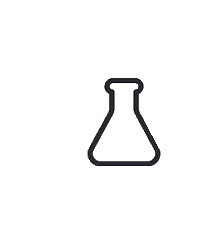

# hofstatter-1.github.io
<!DOCTYPE html>
<html lang="en">
<head>
    <link rel="stylesheet" href="style.css">
    <meta charset="UTF-8">
    <meta name="viewport" content="width=device-width, initial-scale=1.0">
    <title>Formules chimiques</title>
</head>
<body>

    

        
    

    

        <h1>Chemcalc</h1>
    

    

    

Que veux-tu trouver ?

<optgroup style="font-family:verdana">
<label for="operations">Option :</label>
</optgroup>
<select name="operations" id="operations">
    <option value="M">Choisis un option</option>
  <option value="M">masse molaire (g/mol) masse/nombre de mole</option>
  <option value="m">masse de la substance (g) masse molaire * nombre de mole</option>
  <option value="nm">nombre de mole (masse en g) masse(g)/masse molaire</option>
  <option value="np">nombre de mole (#particule)nombre de particule/nombre d'avogadro</option>z
  <option value="N"> nombre de particule, nombre de mole * nombre d'avogadro</option>
  <option value="Na">nombre d'avogadro</option>
</select>

Premiere entrée

<input type="number" id="myNumber" placeholder="entrée un nombre">

Deuxième entrée

<input type="number" id="myNumber" placeholder="entrée un nombre">
<button>Calcul</button>
<output id="a"></output>
<h2 id ="Output"> </h2>
<button onclick="window.print()">imprimer la page</button>
<button onClick="window.location.reload();">supprimer tout</button>

<!--<button onclick = "window.location.href='.vscode\Projet finale\formules chimiques\cwemistwy\index.html';">tableaux periodic</button>-->
    
    
</body>
</html> 
